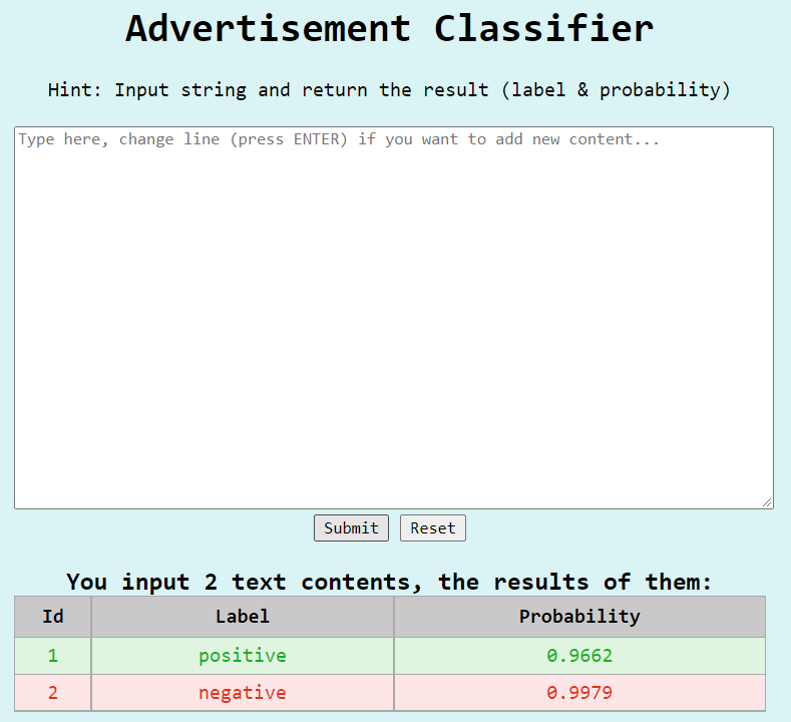
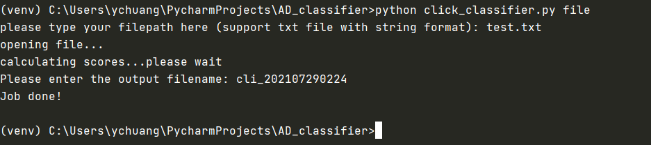
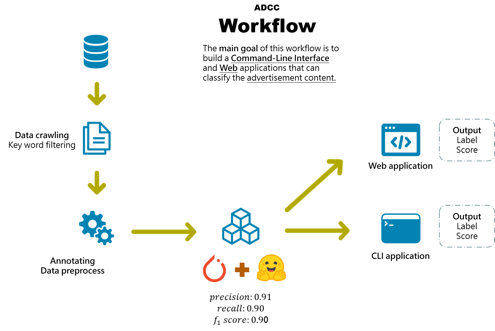
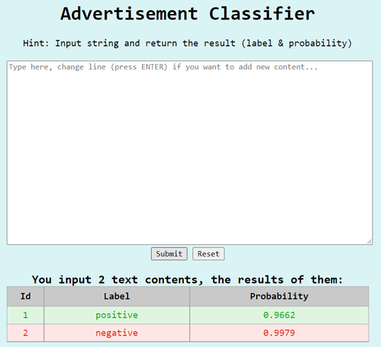

<!-- TABLE OF CONTENTS -->

<details open="open">
  <summary><h2 style="display: inline-block">Table of Contents</h2></summary>
  <ol>
    <li>
      <a href="#about-the-project">About The Project</a>
      <ul>
        <li><a href="#what is advertisement content?">What is advertisement content?</a></li>
        <li><a href="#project-work-flow">Project work flow</a>
        <li><a href="#built-with">Built With</a></li>
      </ul>
    </li>
    <li>
      <a href="#getting-started">Getting Started</a>
      <ul>
        <li><a href="#prerequisites">Prerequisites</a></li>
        <li><a href="#installation">Installation</a></li>
      </ul>
    </li>
    <li><a href="#usage">Usage</a>
     <ul>
        <li><a href="#get-dataset">Get dataset</a></li> 
        <li><a href="#classifier-training">Classifier training</a></li>
        <li><a href="#CLI-application">CLI application</a></li>
        <li><a href="#WEB-application">WEB application</a></li>
      </ul> 
     </li>
  </ol>
</details>

<!-- ABOUT THE PROJECT -->

[Project sildes](AD_classifier.pptx)

## About The Project






### What is an advertisement content?

> An copywriting which is developed from the advertisement industry is the manuscript used in newspapers, magazines, posters and other print media or electronic media, TV commercials, web banners, etc., to promote products, companies, or ideas, or people who do this. 
>
> ​                                                                                                                                                        *from wikipedia*

Others important content of advertisement copywriting also include,

+ Purposeful and strategic text. 
+ The motivation of product sales. 
+ Commercial writing, it is mainly to solve customers' problems. 
+ A text that appears in any form to convey information to the target audience, urge them to act or change their beliefs.


### Project work flow




The project contains <u>three</u> parts of efforts, that is classifier training, **Command line interface (CLI)** application and **WEB** application building. 

+ In first step, we introduce the pre-trained language model, **albert**, from [huggingface transformers](https://huggingface.co/transformers/) and created a simple classifier with [pytorch](https://pytorch.org/). 
+ Secondly, we apply the best model to create application which allow users to classify the advertisement content through CLI, through typing the content or input a text file. It will return the message of label indicate which content is or isn't an advertisement and also return the output probability.
+ Last, we created the WEB version of application which assist user to classify multiple content through directly tying in the text area. The output will return the number of contents that users want to classify, the id of those content, the label (noted that they are in binary string format positive and negative).

For more information of the project please refer to the 

### Built with

This section list all major frameworks that building the project using. 

* [Click](https://click.palletsprojects.com/en/8.0.x/)

* [FastAPI](https://fastapi.tiangolo.com/)

* [Huggingface transformers](https://huggingface.co/transformers/)

* [Jinja2](https://jinja.palletsprojects.com/en/3.0.x/)

* [Pytorch](https://pytorch.org/)

  

<!-- GETTING STARTED -->
## Getting Started

To get a local copy up and running follow these simple steps.

### Prerequisites

This project is built in the python 3.8 environment. Make sure to install the corresponding version. 

+ Windows 10

+ [Python 3.8](https://www.python.org/downloads/release/python-380/)

###### Windows

* Create a virtual environment to re-construct the environment
  
  ```sh
  $ pip install virtualenv
  $ virtualenv venv
  $ venv\Scripts\activate.bat
  ```

### Installation

1. Clone the repo to the environment
   ```sh
   $ git clone https://github.com/ychuang789/AD_classifier.git
   ```
2. Install requirements packages 
   ```sh
   $ pip install -r requirements.txt
   ```

<!-- USAGE EXAMPLES -->
## Usage

### Get dataset

run the command to scrap data from database:

```sh
$set HOST=db host number
$set DB_USER_ID=db user id
$set DB_USER_PWD=db password

$python get_data.py 1000 positive
$python get_data.py 1000 negative
```

+ 1000 means the limit number you want to query the database; positive or negative represent what kind of content you want to scrap from database (AD text or NOT AD text).

+ It will return the dataset that contain `title` and `content` of text, noted that you have to check the dataset and create a new column, `label`, to annotate the dataset with 0 and 1 which represent the negative and positive manually by yourself .

+ Remember to concatenate the `title` and `content` into one column `text` , and export the output `.pkl` file with columns `text` and `label` if you want to test the next section.

### Classifier training

The default model arguments are:

| parameter        | default               | Note                                                         |
| ---------------- | --------------------- | ------------------------------------------------------------ |
| run_number       |                       | run number, change it if you run a new experiment            |
| data             | data.pkl              | support *pickle data* format with column `text` and `label`, replace it by your own dataset or use the default dataset. |
| device           | cpu                   | replace with `cuda:[number]`if  gpu is available             |
| n_classes        | 2                     | number of class, you **don't** have to modify this setting in this project |
| max_len          | 300                   |                                                              |
| batch_size       | 16                    |                                                              |
| epochs           | 10                    |                                                              |
| learning_rate    | 2e-5                  |                                                              |
| num_warmup_steps | 0                     |                                                              |
| loss_func        | nn.CrossEntropyLoss() | loss function                                                |

run the command to train the classifier:

```sh
$ python run.py 1 --data data.pkl --device cpu\
	--batch_size 16 --epochs 10 --learning_rate 1e-5
```

+ Track training and validation information at  `/model/run.log`  

  `run.log` example:

```bash
2021-07-31 06:03:54,229 - INFO -  *** This is run 33 *** 
2021-07-31 06:03:54,229 - INFO - Argument batch_size: 32
2021-07-31 06:03:54,229 - INFO - Argument device: cpu
2021-07-31 06:03:54,229 - INFO - Argument epochs: 10
2021-07-31 06:03:54,229 - INFO - Argument learning_rate: 5e-06
2021-07-31 06:03:54,229 - INFO - Argument loss_func: CrossEntropyLoss()
2021-07-31 06:03:54,229 - INFO - Argument max_len: 300
2021-07-31 06:03:54,229 - INFO - Argument n_classes: 2
2021-07-31 06:03:54,229 - INFO - Argument num_warmup_steps: 0
2021-07-31 06:03:54,229 - INFO - Argument run_number: 33
2021-07-31 06:03:56,092 - INFO -  >>> Tokenizing and building the data loader ... 
2021-07-31 06:04:01,312 - INFO - Epoch 1/10
2021-07-31 06:04:01,312 - INFO - ----------
2021-07-31 06:13:14,006 - INFO - The training is successfully done...
2021-07-31 06:13:14,049 - INFO - Train loss 0.7105835630343511 accuracy 0.5175
2021-07-31 06:14:10,222 - INFO - Val loss 0.6649715453386307 accuracy 0.64
2021-07-31 06:14:10,317 - INFO - Epoch 2/10
2021-07-31 06:14:10,317 - INFO - ----------
2021-07-31 06:23:04,677 - INFO - The training is successfully done...
2021-07-31 06:23:04,696 - INFO - Train loss 0.5781539953671969 accuracy 0.7275
2021-07-31 06:24:01,692 - INFO - Val loss 0.5084943324327469 accuracy 0.74
2021-07-31 06:24:01,770 - INFO - Epoch 3/10
2021-07-31 06:24:01,770 - INFO - ----------
2021-07-31 06:32:55,063 - INFO - The training is successfully done...
2021-07-31 06:32:55,073 - INFO - Train loss 0.4794057034529172 accuracy 0.7625
2021-07-31 06:33:51,933 - INFO - Val loss 0.4919182062149048 accuracy 0.76
2021-07-31 06:33:52,007 - INFO - Epoch 4/10
2021-07-31 06:33:52,007 - INFO - ----------
2021-07-31 06:43:09,712 - INFO - The training is successfully done...
2021-07-31 06:43:09,738 - INFO - Train loss 0.44046159432484555 accuracy 0.7925
2021-07-31 06:44:07,653 - INFO - Val loss 0.3330209255218506 accuracy 0.83
2021-07-31 06:44:07,729 - INFO - Epoch 5/10
2021-07-31 06:44:07,729 - INFO - ----------
2021-07-31 06:53:11,496 - INFO - The training is successfully done...
2021-07-31 06:53:11,511 - INFO - Train loss 0.39091581106185913 accuracy 0.8225
2021-07-31 06:54:09,491 - INFO - Val loss 0.33614598773419857 accuracy 0.83
2021-07-31 06:54:09,495 - INFO - Epoch 6/10
2021-07-31 06:54:09,495 - INFO - ----------
2021-07-31 07:03:00,443 - INFO - The training is successfully done...
2021-07-31 07:03:00,462 - INFO - Train loss 0.31306524804005254 accuracy 0.88
2021-07-31 07:03:55,522 - INFO - Val loss 0.32211490347981453 accuracy 0.89
2021-07-31 07:03:55,600 - INFO - Epoch 7/10
2021-07-31 07:03:55,600 - INFO - ----------
2021-07-31 07:12:50,650 - INFO - The training is successfully done...
2021-07-31 07:12:50,669 - INFO - Train loss 0.27619213782824004 accuracy 0.8875
2021-07-31 07:13:46,838 - INFO - Val loss 0.2925116755068302 accuracy 0.89
2021-07-31 07:13:46,839 - INFO - Epoch 8/10
2021-07-31 07:13:46,840 - INFO - ----------
2021-07-31 07:23:02,121 - INFO - The training is successfully done...
2021-07-31 07:23:02,152 - INFO - Train loss 0.23578611933268034 accuracy 0.91
2021-07-31 07:24:01,041 - INFO - Val loss 0.26734059676527977 accuracy 0.88
2021-07-31 07:24:01,041 - INFO - Epoch 9/10
2021-07-31 07:24:01,041 - INFO - ----------
2021-07-31 07:33:09,273 - INFO - The training is successfully done...
2021-07-31 07:33:09,300 - INFO - Train loss 0.18611031484145385 accuracy 0.94
2021-07-31 07:34:06,693 - INFO - Val loss 0.245844854041934 accuracy 0.89
2021-07-31 07:34:06,697 - INFO - Epoch 10/10
2021-07-31 07:34:06,697 - INFO - ----------
2021-07-31 07:43:08,806 - INFO - The training is successfully done...
2021-07-31 07:43:08,832 - INFO - Train loss 0.15904174745082855 accuracy 0.9475
2021-07-31 07:44:04,713 - INFO - Val loss 0.23112577944993973 accuracy 0.9
2021-07-31 07:44:04,789 - INFO -  *** Well done, the training is over *** 
```

+ Check the output classification report at `/model/evaluate/` 

  For example `classification_report_33.csv`

|              | precision | recall   | f1-score | support |
| ------------ | --------- | -------- | -------- | ------- |
| 0            | 0.978723  | 0.836364 | 0.901961 | 55      |
| 1            | 0.830189  | 0.977778 | 0.897959 | 45      |
| accuracy     | 0.9       | 0.9      | 0.9      | 0.9     |
| macro avg    | 0.904456  | 0.907071 | 0.89996  | 100     |
| weighted avg | 0.911883  | 0.9      | 0.90016  | 100     |

You can find out the best model for each run in the `/model/run/`

```
model\
	run\
		best_model_state_33.bin
		best_model_state_34.bin
		best_model_state_35.bin
```

False predict detail is stored at `/model/false_predict/`

### CLI application

run the command

+ with `single` you are expected to input a single text content in the command line interface
+ with `file` you are expected to input a text file location (each line represent the different content) and it will ask you to name a new csv output file which includes texts with labels and probabilities. The output file will be saved in `/model/cli_output/`:

```sh
$ python click_classifier.py single
```

```sh
$ python click_classifier.py file
```

example:


| content   | label    | probability |
| --------- | -------- | ----------- |
| content_1 | positive | 0.9570      |
| content_2 | negative | 0.9903      |

### WEB application

This WEB application support multiple content classification 

run the command

```sh
$ python web_api.py
```

and open the browser with http://127.0.0.1:8000 to open the WEB application

Type the content which you want to classify and press `ENTER` if you want to add new content. The result will be showed at the bottom of the text area with **id** represent each content, **label** and **probability**. 


